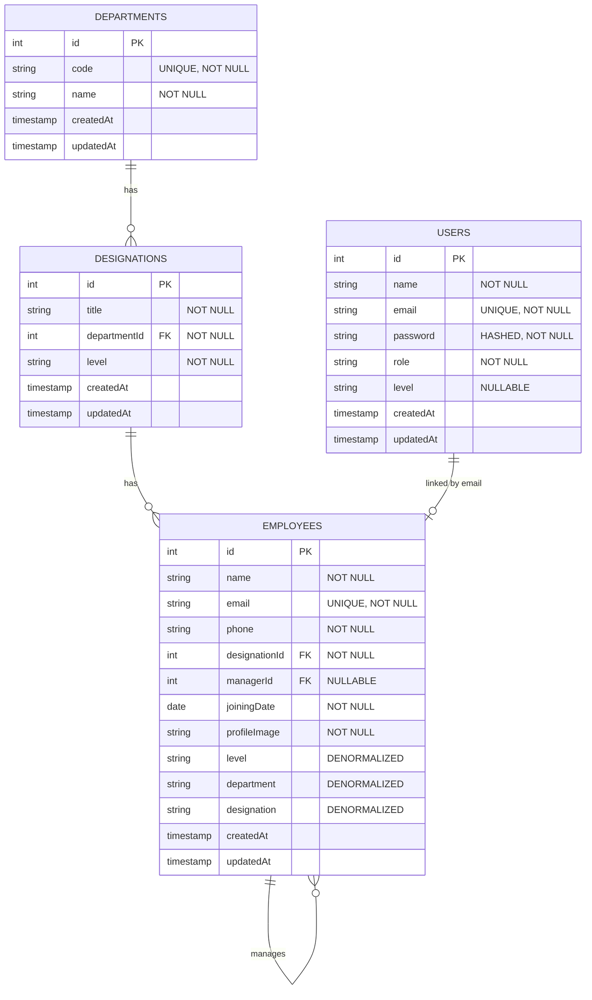

# Database Schema - EmpChartIO - Employee Organization Chart

## Overview
PostgreSQL database normalized to **Third Normal Form (3NF)** with proper foreign key relationships and constraints.

---

## Entity Relationship Diagram



---

## Tables

### 1. Departments (Reference Table)
**Purpose**: Master list of organizational departments

| Column | Type | Constraints | Description |
|--------|------|-------------|-------------|
| id | INTEGER | PRIMARY KEY, AUTO_INCREMENT | Unique identifier |
| code | VARCHAR(50) | UNIQUE, NOT NULL | Department code enum |
| name | VARCHAR(255) | NOT NULL | Display name |
| createdAt | TIMESTAMP | NOT NULL | Creation timestamp |
| updatedAt | TIMESTAMP | NOT NULL | Last update timestamp |

**Values**:
- `EXECUTIVE` → "Executive"
- `TECHNOLOGY` → "Technology"
- `FINANCE` → "Finance"
- `BUSINESS` → "Business"

---

### 2. Designations (Reference Table)
**Purpose**: Master list of job titles with department and level mapping

| Column | Type | Constraints | Description |
|--------|------|-------------|-------------|
| id | INTEGER | PRIMARY KEY, AUTO_INCREMENT | Unique identifier |
| title | VARCHAR(255) | NOT NULL | Job title (e.g., "Software Engineer") |
| departmentId | INTEGER | FOREIGN KEY → departments(id), NOT NULL | Department reference |
| level | VARCHAR(10) | NOT NULL | Employee level (L1-L5) |
| createdAt | TIMESTAMP | NOT NULL | Creation timestamp |
| updatedAt | TIMESTAMP | NOT NULL | Last update timestamp |

**Indexes**:
- `idx_designation_department` on (departmentId)
- `idx_designation_level` on (level)

**Level Mapping**:
- **L1**: C-Suite Officers (CEO, CTO, CFO, CBO)
- **L2**: Managers
- **L3**: Leads
- **L4**: Seniors
- **L5**: Juniors

---

### 3. Employees (Main Table)
**Purpose**: Employee records with organizational hierarchy

| Column | Type | Constraints | Description |
|--------|------|-------------|-------------|
| id | INTEGER | PRIMARY KEY, AUTO_INCREMENT | Unique identifier |
| name | VARCHAR(255) | NOT NULL | Full name |
| email | VARCHAR(255) | UNIQUE, NOT NULL | Email address |
| phone | VARCHAR(50) | NOT NULL | Contact number |
| designationId | INTEGER | FOREIGN KEY → designations(id), NOT NULL | Designation reference |
| managerId | INTEGER | FOREIGN KEY → employees(id), NULLABLE | Manager reference (self-referencing) |
| joiningDate | DATE | NOT NULL | Date of joining |
| profileImage | TEXT | NOT NULL | Avatar URL |
| level | VARCHAR(10) | NOT NULL | Denormalized from designation |
| department | VARCHAR(50) | NOT NULL | Denormalized from designation |
| designation | VARCHAR(255) | NOT NULL | Denormalized job title |
| createdAt | TIMESTAMP | NOT NULL | Creation timestamp |
| updatedAt | TIMESTAMP | NOT NULL | Last update timestamp |

**Indexes**:
- `idx_employee_email` on (email)
- `idx_employee_manager` on (managerId)
- `idx_employee_designation` on (designationId)
- `idx_employee_level` on (level)
- `idx_employee_department` on (department)

**Constraints**:
- Email must be unique
- managerId references employees(id) (self-referencing for hierarchy)
- designationId references designations(id)

**Denormalization Strategy**:
- `level`, `department`, `designation` are denormalized for quick read access
- Source of truth remains in `designations` table
- Updated via triggers/application logic when designation changes

---

### 4. Users (Authentication Table)
**Purpose**: User accounts for authentication and authorization

| Column | Type | Constraints | Description |
|--------|------|-------------|-------------|
| id | INTEGER | PRIMARY KEY, AUTO_INCREMENT | Unique identifier |
| name | VARCHAR(255) | NOT NULL | Full name |
| email | VARCHAR(255) | UNIQUE, NOT NULL | Email address (links to employee) |
| password | VARCHAR(255) | NOT NULL | Bcrypt hashed password |
| role | VARCHAR(20) | NOT NULL | User role (admin/user) |
| level | VARCHAR(10) | NULLABLE | Employee level (from designation) |
| createdAt | TIMESTAMP | NOT NULL | Creation timestamp |
| updatedAt | TIMESTAMP | NOT NULL | Last update timestamp |

**Indexes**:
- `idx_user_email` on (email)
- `idx_user_role` on (role)

**Password Hashing**:
- Bcrypt with 10 salt rounds
- Never stored in plain text

**Roles**:
- `admin`: Full access
- `user`: Standard access

---

## Relationships

### One-to-Many Relationships

1. **Department → Designations**
   - One department has many designations
   - `designations.departmentId → departments.id`

2. **Designation → Employees**
   - One designation can be held by many employees
   - `employees.designationId → designations.id`

3. **Employee → Employees (Self-Referencing)**
   - One manager manages many employees
   - `employees.managerId → employees.id`

### Implicit Relationship

4. **Users ↔ Employees (Linked by Email)**
   - Not a formal FK, but linked logically
   - When user registers, employee record created with same email
   - Both tables have unique email constraint

---

## Normalization (3NF)

### First Normal Form (1NF)
- All columns contain atomic values
- No repeating groups
- Each column contains values of a single type

### Second Normal Form (2NF)
- Meets 1NF requirements
- All non-key attributes depend on entire primary key
- No partial dependencies

### Third Normal Form (3NF)
- Meets 2NF requirements
- No transitive dependencies
- Department info stored in departments table (not repeated)
- Designation info stored in designations table (not repeated)
- Level derived from designation (source of truth)

### Denormalization Strategy
**Why denormalize `level`, `department`, `designation` in employees table?**
- **Performance**: 90% of queries read employee data with these fields
- **Query simplicity**: Avoid JOINs for common read operations
- **Read-heavy workload**: Organization charts are read far more than written
- **Controlled redundancy**: Application ensures consistency on updates

---

## Constraints & Validation

### Database Level
- Primary keys on all tables
- Foreign key constraints with ON DELETE rules
- UNIQUE constraints on email fields
- NOT NULL constraints on required fields
- CHECK constraints on enum values (level, department, role)

### Application Level
- Email uniqueness validation
- Manager hierarchy validation (manager.level < employee.level)
- Circular reference prevention (A → B → C → A)
- Self-assignment prevention (employee cannot be own manager)
- Password strength requirements

---

## Indexes

### Primary Indexes
- `departments(id)` - PK
- `designations(id)` - PK
- `employees(id)` - PK
- `users(id)` - PK

### Foreign Key Indexes
- `designations(departmentId)` - FK to departments
- `employees(designationId)` - FK to designations
- `employees(managerId)` - FK to employees (self-ref)

### Query Optimization Indexes
- `employees(email)` - Unique lookup
- `employees(level)` - Filter by level
- `employees(department)` - Filter by department
- `users(email)` - Authentication lookup
- `users(role)` - RBAC checks

---

## Sample Data Structure

### Departments
```sql
INSERT INTO departments (code, name) VALUES
  ('EXECUTIVE', 'Executive'),
  ('TECHNOLOGY', 'Technology'),
  ('FINANCE', 'Finance'),
  ('BUSINESS', 'Business');
```

### Designations (Example)
```sql
INSERT INTO designations (title, departmentId, level) VALUES
  ('Chief Executive Officer', 1, 'L1'),
  ('Chief Technology Officer', 2, 'L1'),
  ('Engineering Manager', 2, 'L2'),
  ('Senior Software Engineer', 2, 'L4'),
  ('Software Engineer', 2, 'L5');
```

### Employees (Example)
```sql
INSERT INTO employees (name, email, phone, designationId, managerId, joiningDate, profileImage, level, department, designation) VALUES
  ('Sarah Johnson', 'sarah.johnson@empchartio.com', '+1-555-0001', 1, NULL, '2020-01-01', 'https://i.pravatar.cc/150?img=45', 'L1', 'EXECUTIVE', 'Chief Executive Officer'),
  ('Michael Chen', 'michael.chen@empchartio.com', '+1-555-0002', 2, 1, '2020-02-01', 'https://i.pravatar.cc/150?img=12', 'L1', 'TECHNOLOGY', 'Chief Technology Officer');
```

### Users (Example)
```sql
INSERT INTO users (name, email, password, role, level) VALUES
  ('Sarah Johnson', 'sarah.johnson@empchartio.com', '$2b$10$hashedpassword...', 'admin', 'L1');
```

---

## Hierarchy Rules

### Manager Assignment Rules
1. **Level Constraint**: Manager must have lower level number (higher rank)
   - L1 can manage L2, L3, L4, L5
   - L2 can manage L3, L4, L5
   - L5 cannot manage anyone

2. **Circular Reference Prevention**
   - Cannot create loops: A → B → C → A
   - Validated recursively in application layer

3. **Self-Assignment Prevention**
   - Employee cannot be their own manager
   - `managerId != employeeId`

4. **Top-Level Employees**
   - managerId can be NULL (e.g., CEO has no manager)

---

## Query Patterns

### Common Read Operations

**Get all employees with hierarchy info:**
```sql
SELECT 
  e.id, e.name, e.email, e.level, e.department, e.designation,
  m.name as managerName, m.level as managerLevel
FROM employees e
LEFT JOIN employees m ON e.managerId = m.id;
```

**Get organization tree (recursive):**
```sql
WITH RECURSIVE org_tree AS (
  SELECT id, name, managerId, level, 1 as depth
  FROM employees
  WHERE managerId IS NULL
  
  UNION ALL
  
  SELECT e.id, e.name, e.managerId, e.level, ot.depth + 1
  FROM employees e
  INNER JOIN org_tree ot ON e.managerId = ot.id
)
SELECT * FROM org_tree ORDER BY depth, level;
```

**Get direct reports:**
```sql
SELECT * FROM employees
WHERE managerId = ?;
```

---

## Migration Strategy

### From Legacy Schema
If migrating from enum-based schema:

1. **Create reference tables** (departments, designations)
2. **Populate reference data** from constants
3. **Add new FK columns** to employees (designationId)
4. **Migrate data** (map string designation → designationId)
5. **Add denormalized columns** (level, department, designation)
6. **Drop old enum columns**
7. **Add indexes** on new columns

---

## Maintenance

### Regular Tasks
- [ ] Monitor index usage with `EXPLAIN ANALYZE`
- [ ] Vacuum tables periodically for PostgreSQL
- [ ] Update statistics for query optimizer
- [ ] Archive old employee records (soft delete)
- [ ] Backup database daily

### Schema Updates
- [ ] Add new designations via INSERT into designations table
- [ ] Update employee denormalized fields when designation changes
- [ ] Ensure referential integrity with foreign keys

---

*Last Updated: November 18, 2024*